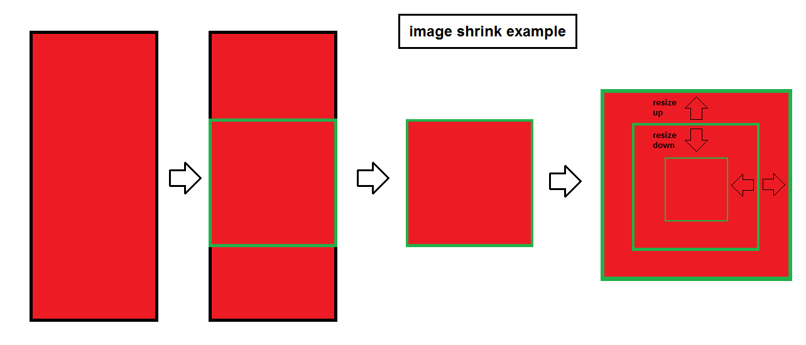

vision_stuff
===========
Tools for image conversion.
(vision-tools was already taken, that's why its vision_stuff :))

Info
===========
Collection of functions for convertion images with python opencv. For now one useful function is shrink_image and its derivative shrink_and_store_images_dir. It let us to shrink image(s), to specified size. Useful, when we have a couple of different shape images and want all of them to be e.g. 640x640.

Install
===========

.. code-block:: python

    pip install vision_stuff

Usage from python
===========

.. code-block:: python

    from vision_stuff import shrink_image

    # example
    img = cv2.imread('image_to_be_shrinked.png', 1)
    out = shrink_image(img, 400, 400)
    cv2.imwrite('out.png', out)
    
    
.. code-block:: python

    from vision_stuff import shrink_and_store_images_dir
    
    directory = 'different_shape_images'
    shrink_and_store_images_dir(directory)
    # it convert images and store them into new directory named (directory + "_converted")
    
    
Algorithm of "shrink_image" function conversion
===========

Todo
===========
03.06.2020, todo:

    - add command line tools
    
    - add more useful function/classes
